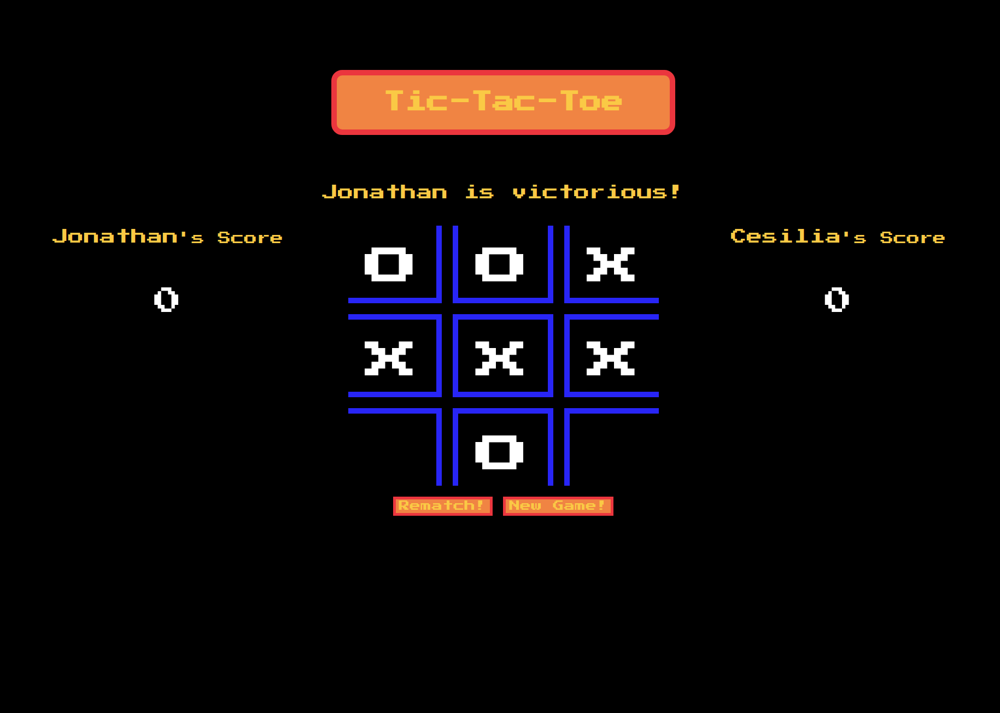

# Library Project

This project builds a simple tic-tac-toe game in the browser. It will have:
* Unbeatable AI
* Winning Screen
* Continuous Games without Refresh
* Name Input

This is a project from [The Odin Project](https://www.theodinproject.com/courses/javascript/lessons/tic-tac-toe-javascript).

## Pre-Project Thoughts

Last lesson threw a lot of big JavaScript words at me. Now's the time to use some of them.

## Post-Project Thoughts

Learned a lot about what NOT to do and wrote some messy code in the process.
I have a much better understanding of event listeners, modules, and factories now though.
